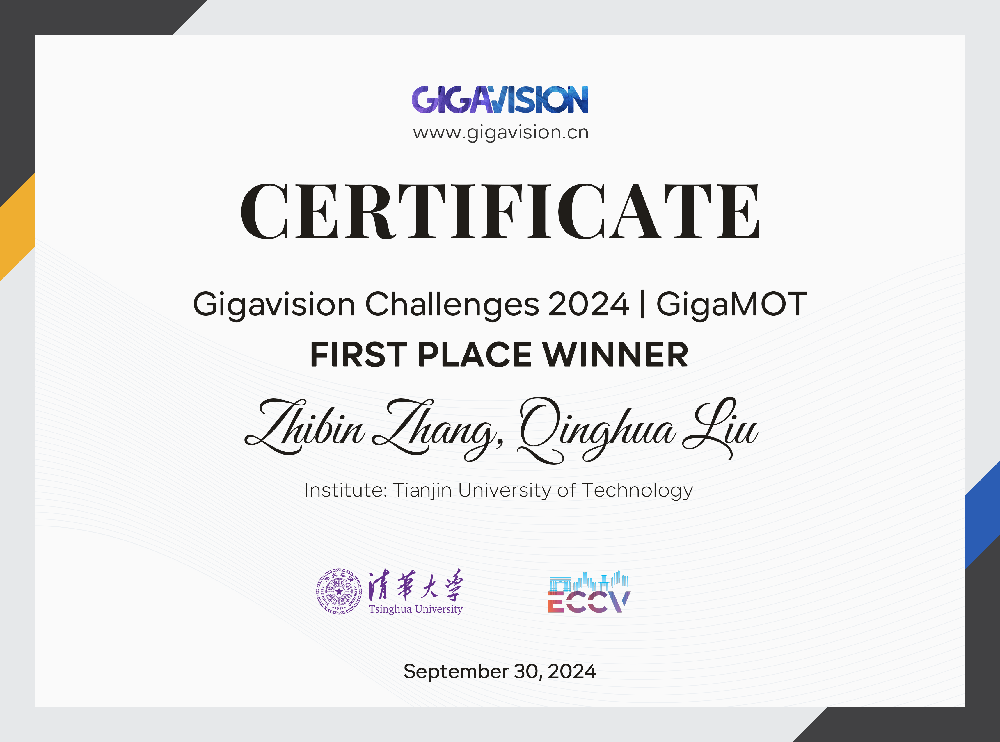

# SPDet

## Installation
### 1. Installing on the host machine
Step1. Install spdet.
```shell
unzip SPDet-master.zip
cd SPDet-master
pip3 install -r requirements.txt
python3 setup.py develop
```

Step2. Install [pycocotools](https://github.com/cocodataset/cocoapi).

```shell
pip3 install cython; pip3 install 'git+https://github.com/cocodataset/cocoapi.git#subdirectory=PythonAPI'
```

Step3. Others
```shell
pip3 install cython_bbox
```
### 2. Docker build
```shell
docker build -t gigatrack:1.0.1 .

docker run --gpus all --name spdet_test -it  -v  /data/PANDA:/workspace/gigatrack/datasets/PANDA  -v $PWD/pretrained:/workspace/gigatrack/pretrained -v $PWD/YOLOX_outputs:/workspace/gigatrack/YOLOX_outputs  gigatrack:1.0.1 /bin/bash  

```

### Model zoo
Firstly download the [bytetrack_s_mot17.pth.tar](https://drive.google.com/file/d/1uSmhXzyV1Zvb4TJJCzpsZOIcw7CCJLxj/view?usp=sharing) model and save it to `./pretrained`.

## Data preparation

```
datasets
   |——————PANDA
   |        └——————PANDA-Image
   |                  └——————image_test
   |                              └——————14_OCT_Habour
   |                                                  └——————IMG_14_01.jpg
   |                                                  └——————IMG_14_02.jpg
   |                                                  └——————IMG_14_03.jpg
   |                                                  └——————...
   
```

## Competition



## Acknowledgement

A large part of the code is borrowed from [SPDet](https://github.com/TJUT-CV/SPDet) and [ByteTrack](https://github.com/ifzhang/ByteTrack).
